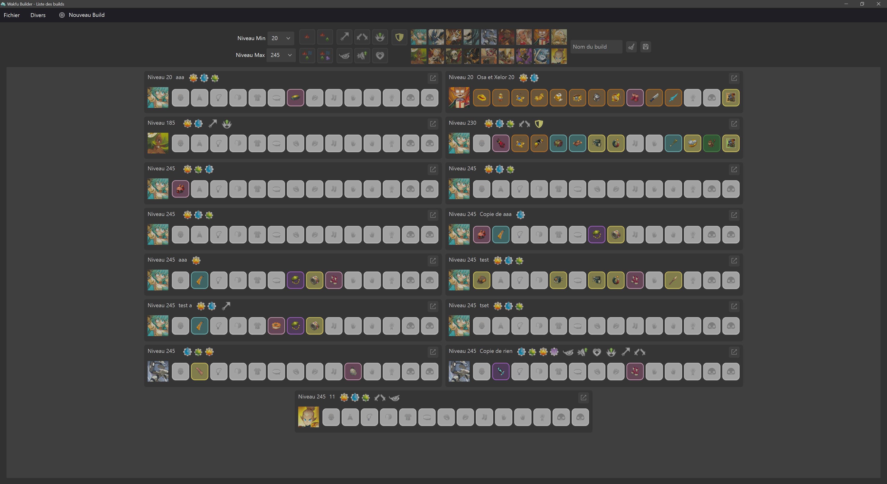
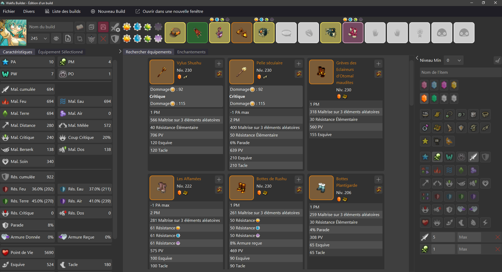
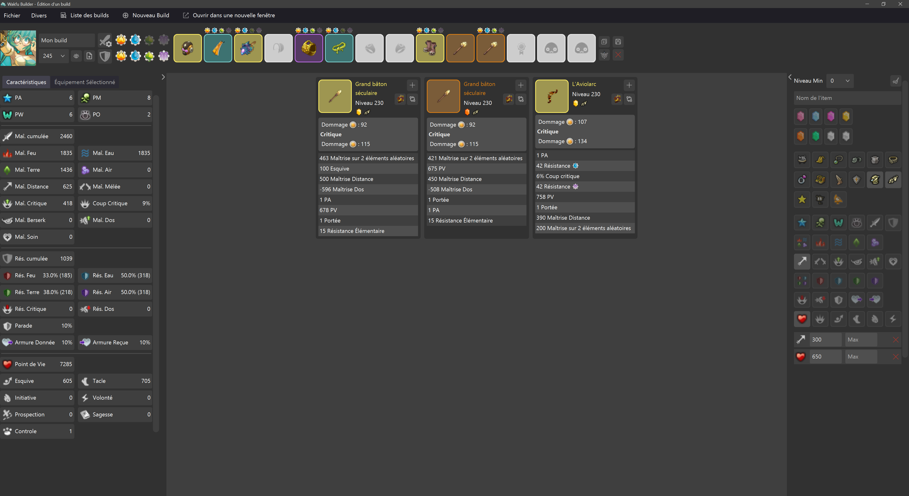
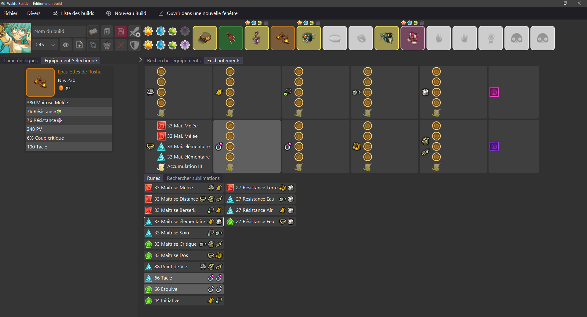
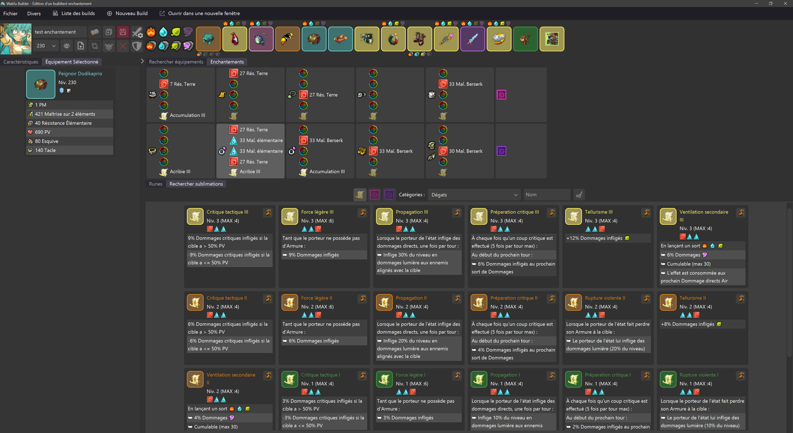
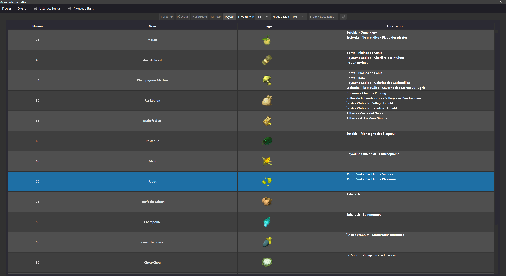
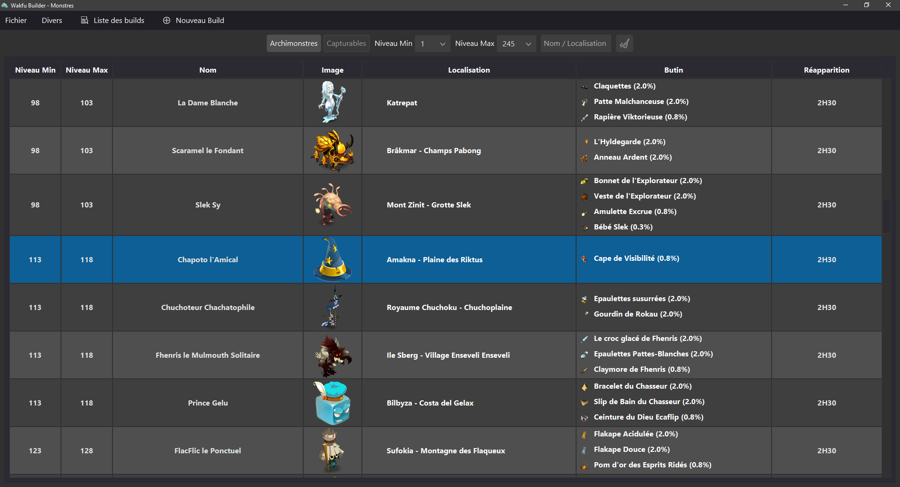
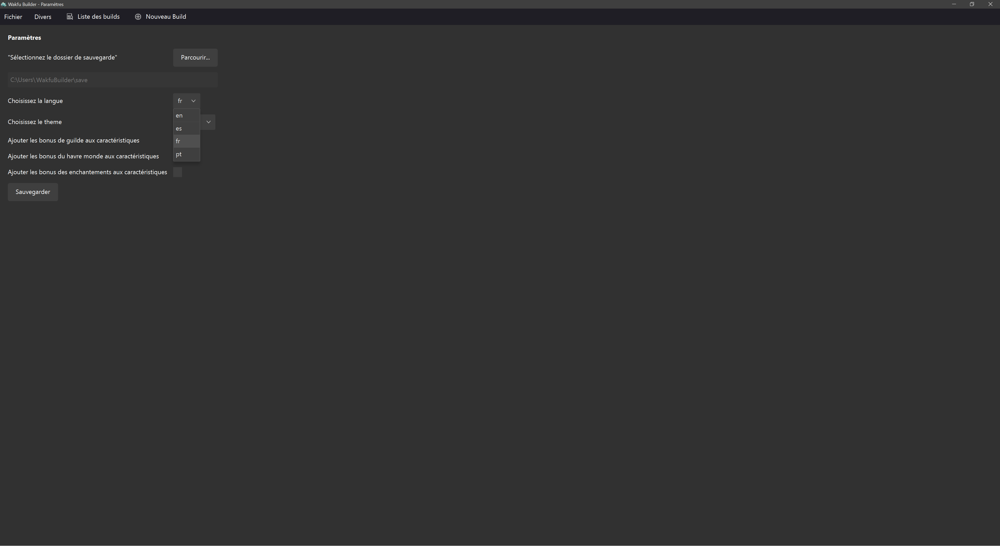

# WakfuBuilder - FR

WAKFU est un MMORPG édité par Ankama. "WakfuBuilder" est un logiciel non-officiel sans aucun lien avec Ankama.

## Description
**WakfuBuilder** est un programme conçu pour crée des builds avec de nombreuses options de recherche et personnalisation pour Wakfu. 


### Vous pouvez soutenir via un don paypal : 


---
## Prérequis
1. **Version de Java :**
   - Assurez-vous d'avoir **Java 22 ou supérieur** d'installé sur votre système. Vous pouvez télécharger la dernière version de Java depuis [le site officiel de Java](https://www.oracle.com/java/technologies/javase-downloads.html).
   - Pour vérifier votre version de Java, utilisez cette commande dans un terminal ou une invite de commandes :
     ```bash java -version```
---

# WakfuBuilder - EN

## Description
**WakfuBuilder** is a program designed to create builds with many search and customization options for Wakfu.

---
## Prerequisites
1. **Java Version:**
   - Make sure you have **Java 22 or higher** installed on your system. You can download the latest version of Java from [the official Java website](https://www.oracle.com/java/technologies/javase-downloads.html).
   - To check your Java version, use this command in a terminal or command prompt:
     ```bash
     java -version
     ```
---

## Preview
## Preview








